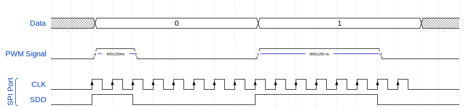
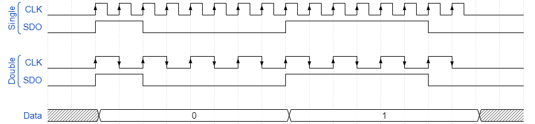
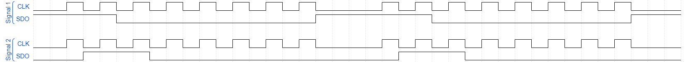

# WS2812B SPI Driver

Philipp Schilk 2021



# Usage

Allows the usage of a standard SPI peripheral to generate the PWM/One-wire signal required
by WS2812B-Style LEDs.

The input of the first LED is connected to the SDO pin of the SPI peripheral. No other
SPI outputs are needed

Because the exact timings of the output will depend on implementation details and
the specific device used, a number of adjustment parameters are provided.

Using these it should be possible to generate a usable signal using most SPI peripherals
that are capable of running fast enough. 

This driver will handle all data formatting. SPI transmission is platform-dependent and not provided,
as it will have to be implemented on a per-device basis.

This driver can be used in either buffered or unbuffered mode.

### Buffered:

In this mode, all LED information is converted and saved into a single buffer.
This buffer can then be transmitted as a whole, for example using DMA.

This method has a larger RAM overhead: Up to 24 bytes are required per LED.

However, it is usually the easiest to use and, if used with DMA, will usually
provide the most consistent timing. 

If the RAM overhead can be tolerated, it is recommended. 

### Unbuffered:

In this mode, one byte at a time can be requested from the driver to be transmitted.

This will reduce RAM-overhead, but will usually increase interrupt load and processing
overhead.

Furthermore the time between SPI bytes is critical and has to be consistent and very short. 
Any interrupt-based implementation must run at a high enough priority to be handled instantly.

## Driver Configuration & Settings

The driver provides some adjustment parameters to be able to overcome hardware differences.

It is unlikely that the default settings will work right away. It is recommended to look
at the output waveform with a scope, and adjust driver parameters and SPI clock frequency
to match the timing in the datasheet.

All configuration parameters are located in the `config` struct in the `ws2812b_handle_t` handle.

### Packing

This driver creates the different-length pulses by sending different numbers of 1's and
0's via the SPI port.

A single byte sent via the SPI port can be used to generate one (single packing) or two (double
packing) bit-pulses.

This is illustrated in the diagram below.



While double packing will need less RAM space in buffered mode and allow the SPI port 
to be run at a lower frequency, it leaves less timing margin than single packing mode. 
Therefore it is generally more likely for single packing to work on a give platform.

```c
ws2812b_handle_t h;
h.config.packing = WS2812B_PACKING_SINGLE; // or WS2812B_PACKING_DOUBLE 
```

### Pulse Length

The short and long pulses corresponding to one and zero respectively have to be 
of the correct length to be detected correctly by the LED.

Because the exact SPI clock speed may vary and the exact waveform may depend
on some other hardware-specific property, the number of 1's send to create a long 
pulse and short pulse can be adjusted

Generally, the following settings are a good starting point for single-packing:
```c
ws2812b_handle_t h;
h.config.pulse_len_1 = WS2812B_PULSE_LEN_6b;
h.config.pulse_len_0 = WS2812B_PULSE_LEN_2b;
```
   
The following settings are a good starting point for double-packing:
```c
ws2812b_handle_t h;
h.config.pulse_len_1 = WS2812B_PULSE_LEN_2b;
h.config.pulse_len_0 = WS2812B_PULSE_LEN_1b;
```

### First-bit-0

On some hardware platforms with some clock-polarity settings (especially if the SPI peripheral features an
internal buffer, like on the STM32), the first bit of the next byte may already
be present on the SDO line right after the previous byte is transmitted.

If there is any time between byte-transfers, this may *greatly* increase the pulse length of all
pulses.

To counteract this, the driver can format every byte to start with a 0, to ensure the SDO line
remains low in between byte transmission.

This is best demonstrated visually:



Both signal 1 and 2 are create by sending three consecutive 1's via the SPI port.

Due to the SPI setup and MCU used in this example, there are significant gaps between byte transmission,
and the first bit of the second byte is already present on the SDO line after the first byte
is transmitted.

By setting the first bit of the transmitted byte to 0 in signal 2, the pulses are much shorter.

Most of the time this feature should be enabled, but again: inspecting the output waveforms with
an oscilloscope and comparing the timing to the LED datasheet will yield the best results.

```c
ws2812b_handle_t h;
h.config.first_bit_0 = WS2812B_FIRST_BIT_0_ENABLED; // or WS2812B_FIRST_BIT_0_DISABLED
```

### Prefix Length and Suffix Length

For the output signal to be interpretable by the LEDs, the SDO line needs
to remain low in between transmission. 

Usually SPI peripherals will maintain the last bit transmitted on SDO line 
until the next transmission starts. 

For this reason the driver can add a prefix and suffix of 0x00 bytes to the transmission.

The prefix_len and suffix_len settings control how many 0x00 bytes are sent before and after the
data respectively.

Note: Some SPI peripherals (Notably on most STM32 MCUs) have a 4-byte deep buffer.
On these devices, the suffix should be four or more bytes long to guarantee the SDO line being kept low.

In general, a prefix of 1 byte and suffix of 4 bytes are recommended as a starting point.

```c
ws2812b_handle_t h;
h.config.prefix_len = 1;
h.config.suffix_len = 4;
```

### SPI bit order

The driver can format the data correctly for both MSB-first and LSB-first
SPI transmission. Select the bit order with which the data will be transmitted.

```c
ws2812b_handle_t h;
h.config.spi_bit_order = WS2812B_MSB_FIRST; // Or WS2812B_LSB_FIRST
```

### SPI Setup

The SPI port should be set to 8-bit transmission.

The SPI mode or clock edge/polarity usually does not impact transmission, but may
on some platforms.

The SPI port should be run at approximately 6.5MHz in single packing mode and
3.2MHz in double packing mode. The exact frequency may vary a lot (+/- 1MHz) and is
best determined experimentally.

Both LSB-first and MSB-first transmission are supported. See Driver Setup.

It is usually beneficially to transmit four empty bytes (0x00) during startup to 
ensure the data-line starts low. 

Again: Different platforms may need different clock frequencies and clock edge/polarity settings.
Use an oscilloscope to examine the output waveform and adjust accordingly.

## Driver Usage

### Installation

Include [src/ws2812b.c](src/ws2812b.c) and [src/ws2812b.h](src/ws2812b.h).

### Usage: Buffered

- Configure the SPI port as described above.
- Create a `ws2812b_handle_t` handle.
- Configure all driver settings in the `config` member of the handle as described above.
- Create an array of LEDs (`ws2812b_led_t`) and set the colors as desired.
- Add the array and the number of LEDs to the handle.
- Call `ws2812b_init(...)` to initialize the driver.
- Create a `uint8_t` buffer of required length, which can be determined using the `WS2812B_REQUIRED_BUFFER_LEN(...)` macro.
- Fill the buffer using `ws2812b_fill_buffer(...)`.
- Transmit the buffer via SPI.

To update the LEDs, the led array can be modified, the buffer re-filled, and re-transmitted.

Important: Make sure to respect the minimum time between packages before sending another package!
This varies between LED models. Check the datasheet.

### Example: Buffered
```c
#define PACKING WS2812B_PACKING_SINGLE
#define PREFIX_LEN 1
#define SUFFIX_LEN 4
#define LED_COUNT 3

int main(){
    // Init SPI....

    // Transmit 4 empty bytes to ensure SDO is low.
    uint8_t d[4] = {0};
    HAL_SPI_Transmit(&hspi1, d, 4, 100);

    // Create handle and configure
    ws2812b_handle_t hws2812b;

    hws2812b.config.packing = PACKING; // See macro above
    hws2812b.config.pulse_len_1 = WS2812B_PULSE_LEN_6b; 
    hws2812b.config.pulse_len_0 = WS2812B_PULSE_LEN_2b;
    hws2812b.config.first_bit_0 = WS2812B_FIRST_BIT_0_ENABLED;
    hws2812b.config.prefix_len = PREFIX_LEN; // See macro above
    hws2812b.config.suffix_len = SUFFIX_LEN; // See macro above
    hws2812b.config.spi_bit_order = WS2812B_LSB_FIRST;

    // Create array of LEDs & set LED color
    ws2812b_led_t leds[LED_COUNT];

    leds[0].red = 0xff;
    leds[0].green = 0;
    leds[0].blue = 0;

    // Set LED 1 and 2 ...

    // Add LEDs and count to handle
    hws2812b.led_count = LED_COUNT;
    hws2812b.leds = leds;

    // Initialize the driver
    if(hws2812b_init(&hws2812b)){
        printf("Invalid ws2812b config! (%s)\r\n",ws2812b_error_msg);
        while(1) {;}
    }

    // Create buffer
    uint8_t dma_buf[WS2812B_REQUIRED_BUFFER_LEN(LED_COUNT, PACKING, PREFIX_LEN, SUFFIX_LEN)];

    while (1) {   
        // Fill buffer
        ws2812b_fill_buffer(&hws2812b, dma_buf);
        
        // Transmit
        HAL_SPI_Transmit_DMA(&hspi1, dma_buf, WS2812B_REQUIRED_BUFFER_LEN(hws2812b.led_count, hws2812b.packing));
        HAL_Delay(10); // 10ms delay
    }
}
```

### Usage: Unbuffered

- Configure the SPI port as described above.
- Create a `ws2812b_handle_t` handle.
- Configure all driver settings in the `config` member of the handle as described above.
- Create an array of LEDs (`ws2812b_led_t`) and set the colors as desired.
- Add the array and the number of LEDs to the handle.
- Transmit one byte at a time, by requesting each byte from the iterator.
    - `ws2812b_iter_next(...)` returns the next byte to be transmitted and advances the iterator. Once the iterator
      finishes, this function will indefinitely return 0. It is therefore save to continuously call the `ws2812b_iter_next(...)`
      function and transmit the result, even if the iterator finishes.
    - The iterator can at any time be restarted with `ws2812b_iter_restart(...)`.
    - `ws2812b_iter_is_finished(...)` can be used to check if there are no more bytes left.

Because the timing between bytes is critical, and the `ws2812b_iter_next(...)` function may take a non-constant amount to return,
it is recommended to pre-calculate the next byte(s), so they can be transmitted as fast as possible.

### Example: Unbuffered

```c
// Next 4 bytes to be transmitted
uint8_t next_bytes[4];

int main(){
    // Init SPI....

    // Transmit 4 empty bytes to ensure SDO is low.
    uint8_t d[4] = {0};
    SPI_TX(d, 4, 100);

    // Create handle and configure
    ws2812b_handle_t hws2812b;

    hws2812b.config.packing = WS2812B_PACKING_DOUBLE;
    hws2812b.config.pulse_len_1 = WS2812B_PULSE_LEN_6b; 
    hws2812b.config.pulse_len_0 = WS2812B_PULSE_LEN_2b;
    hws2812b.config.first_bit_0 = WS2812B_FIRST_BIT_0_ENABLED;
    hws2812b.config.prefix_len = 1; // See macro above
    hws2812b.config.suffix_len = 4; // See macro above
    hws2812b.config.spi_bit_order = WS2812B_LSB_FIRST;

    // Create array of LEDs & set LED color
    ws2812b_led_t leds[3];

    leds[0].red = 0xff;
    leds[0].green = 0;
    leds[0].blue = 0;

    // Set LED 1 and 2 ...

    // Add LEDs and count to handle
    hws2812b.led_count = 3;
    hws2812b.leds = leds;

    // Initialize the driver
    if(hws2812b_init(&hws2812b)){
        printf("Invalid ws2812b config! (%s)\r\n",ws2812b_error_msg);
        while(1) {;}
    }
    
    // Start first transmission
    for(int i = 0; i < 4; i++){ 
        next_bytes[i] = ws2812b_iter_next(&hws2812b); 
    }
    SPI_TX_IT(&first_four_bytes, 4);
    
    // Pre-calculate next four bytes 
    for(int i = 0; i < 4; i++){ 
        next_bytes[i] = ws2812b_iter_next(&hws2812b); 
    }
    
    while (1) {   
        // Restart iterator every 10ms:
        ws2812b_iter_restart(&hws2812b);
        Delay(10);
    }
}

void SPI_TX_Done_Callback(){
    // Transmit next 4 bytes 
    SPI_TX_IT(&next_bytes, 4);
    // Pre-calculate next four bytes 
    for(int i = 0; i < 4; i++){ 
        next_bytes[i] = ws2812b_iter_next(&hws2812b); 
    }
}

```

## Further details 

### Configuration Errors

The `ws2812b_init(...)` will perform some sanity checking on the configuration.

If the configuration is invalid, `ws2812b_init(...)` will return non-zero, and a 
diagnostic message will be placed in `char *ws2812b_error_msg`.

If the RAM overhead for the error message is too much, it can be disabled by
uncommenting the following line in ws2812b.h:
```c
// #define WS2812B_DISABLE_ERROR_MSG
```

### Flags

The driver complies with/compiles under:
```
-Wall -Wextra -Wpedantic -Werror=vla
```

### VLAs

The DMA buffer has to be allocated by the user. 

To avoid the unnecessary usage of VLAs, a compile-time macro to calculate the required buffer 
length (`WS2812B_REQUIRED_BUFFER_LEN(...)`) is provided in addition to the function `ws2812b_required_buffer_len(...)`.


## Development Notes

Development requirements:
 - *GNU* make
 - gcc
 - Standard POSIX utilities (mainly rm)
 - clang-format
 - Python 3.5+

Currently only tested under Linux.

### Compilation

To compile and run all tests:

```bash
make all
```

### Unit testing

Unit testing is handled with Throw The Switch's [Unity](https://github.com/ThrowTheSwitch/Unity) testing framework, which is included in the 
repository ([test/Unity/](test/Unity/)).

All tests are in [test/](test/).

Make calls [scripts/run_tests.py](scripts/run_tests.py) to run tests, generate reports, and print results.

### Formatting

Formatting handled with clang_format.

All code committed should conform to the [.clang_format](.clang_format) file included. 

To format all code run:
```bash
make format
```
A git pre-commit hook to verify formatting is provided. See [scripts/pre-commit](sripts/pre-commit) and [scripts/install_hooks.sh](scripts/install_hooks.sh).

